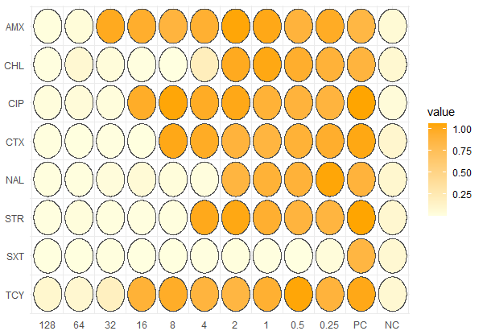

# MICA

MICA is a workflow for minimal inhibitory concentration (MIC) analysis in R. The goal of this workflow is to allow users the easy assessment of antimicrobial resistance profiles of their lab strains. More information on MICs can be found in the STAR protocol by [Barnes et al., 2023](https://www.sciencedirect.com/science/article/pii/S2666166723004793).

The MICA workflow is designed for **MIC assays** conducted in **96-well plates**, utilizing a **specified concentration range** across different antimicrobials. While the workflow is tailored to this setup, it **can be adapted to fit alternative MIC assay** specifications if needed. For this example, we assume the following layout:

- **Plate size:**                               96-well plates
- **Antimicrobial concentrations (columns):**   2-fold concentration changes
- **Organisms tested:**                         1 simulated *Escherichia coli* strain from non-human origin
- **Antimicrobials tested:**                    Amoxicillin (AMX)
                                                Chloramphenicol (CHL)
                                                Ciprofloxacin (CIP)
                                                Cefotaxime (CTX)
                                                Nalidixic acid (NAL)
                                                Streptomycin (STR)
                                                Trimethoprim/Sulfamethoxazole (SXT)
                                                Tetracycline (TCY)

## Pre-requisites required

Please make sure to install the following R packages beforehand, as they will be required for the tutorial:

```r
install.packages("AMR")
install.packages("devtools")
install.packages("ggforce")
install.packages("ggplot2")
install.packages("scales")
install.packages("tidyverse")
install.packages("viridis")

devtools::install_github("jpquast/ggplate")
```

## Import of absorbance data from spectrophotometer

In the first step, it will be required to load the actual absorbance data, obtained via a spectrophotometer after microbial growth. In this workflow, we assume that the spectrophotometer read-out will be from a 96-well plate.

For the purpose of this tutorial, let's assume that the layout of the 96-well plate is the following:


Consequently, we assume that only one strain was tested for antimicrcobial resistance using **8 different antimicrobials (rows)** with **2-fold increasing concentrations (columns)**. The last two columns of the 96-well plate are a **Positive Control (PC)** and a **Negative Control (NC)**.

The example data can be loaded using the following command:

```r
# Loading of R packages
library(ggforce)
library(ggplate)
library(ggplot2)
library(scales)
library(tidyverse)

# Creating example data
absorbance_data <- matrix(c(
  0.019, 0.040, 1.000, 0.950, 0.880, 0.930, 1.050, 1.020, 0.890, 0.980, 0.850, 0.060,  # Row A
  0.008, 0.079, 0.033, 0.008, 0.002, 0.200, 1.000, 1.030, 0.950, 0.900, 0.880, 0.087,  # Row B
  0.022, 0.043, 0.023, 0.970, 1.050, 0.980, 1.020, 0.910, 0.890, 0.880, 1.060, 0.043,  # Row C
  0.013, 0.007, 0.009, 0.007, 1.020, 0.980, 0.890, 0.870, 0.910, 0.950, 1.030, 0.101,  # Row D
  0.015, 0.013, 0.032, 0.056, 0.030, 0.021, 0.870, 0.910, 0.900, 1.050, 0.890, 0.098,  # Row E
  0.008, 0.022, 0.014, 0.009, 0.011, 1.010, 1.030, 0.940, 0.880, 0.870, 1.060, 0.093,  # Row F
  0.007, 0.005, 0.011, 0.003, 0.005, 0.009, 0.019, 0.010, 0.004, 0.033, 0.860, 0.081,  # Row G
  0.099, 0.093, 0.180, 0.910, 0.970, 0.880, 0.860, 0.930, 1.050, 0.890, 1.020, 0.078   # Row H
), nrow = 8, ncol = 12, byrow = TRUE)

# Transform example data to dataframe
df_plate <- as.data.frame(absorbance_data)
```

The loaded dataframe in R will look the following:

|       | V1 | V2 | V3 | V4 | V5 | V6 | V7 | V8 | V9 | V10 | V11 | V12 |
|-------|-------|-------|-------|-------|-------|-------|-------|-------|-------|--------|--------|--------|
| **1** | 0.156 | 0.200 | 1.000 | 0.950 | 0.880 | 0.930 | 1.050 | 1.020 | 0.890 | 0.980  | 0.850  | 0.060  |
| **2** | 0.172 | 0.123 | 0.102 | 0.088 | 0.112 | 0.200 | 1.000 | 1.030 | 0.950 | 0.900  | 0.880  | 0.087  |
| **3** | 0.094 | 0.132 | 0.150 | 0.970 | 1.050 | 0.980 | 1.020 | 0.910 | 0.890 | 0.880  | 1.060  | 0.043  |
| **4** | 0.095 | 0.103 | 0.100 | 0.980 | 1.020 | 0.980 | 0.890 | 0.870 | 0.910 | 0.950  | 1.030  | 0.101  |
| **5** | 0.092 | 0.095 | 0.097 | 0.094 | 0.300 | 1.030 | 0.870 | 0.910 | 0.900 | 1.050  | 0.890  | 0.098  |
| **6** | 0.098 | 0.250 | 1.020 | 1.000 | 0.950 | 1.010 | 1.030 | 0.940 | 0.880 | 0.870  | 1.060  | 0.093  |
| **7** | 0.095 | 1.020 | 1.000 | 0.940 | 1.050 | 0.900 | 0.880 | 0.920 | 0.890 | 0.980  | 0.860  | 0.081  |
| **8** | 0.099 | 0.093 | 0.180 | 0.910 | 0.970 | 0.880 | 0.860 | 0.930 | 1.050 | 0.890  | 1.020  | 0.078  |

## Modify absorbance data for analysis and plotting

Now that we have imported the absorbance data from the spectrophotometer, let's bring it into the right format by **adding the customized labels to the rows and columns** of our dataframe as in the example layout above: 

```r
custom_row_labels <- c("AMX", "CHL", "CIP", "CTX", "NAL", "STR","SXT", "TCY")

custom_col_labels <- c("128", "64", "32", "16", "8", "4",
                       "2", "1", "0.5", "0.25", "PC", "NC")
```

Please note, to enable comparison with EUCAST or CLSI clinical breakpoints, use antimicrobial abbreviations as `custom_row_labels`. If guideline comparison is not needed, feel free to choose any labeling that best suits your assay setup. For plotting and further analysis, convert the dataframe into a long format using pivot_longer().

```r
df_plate <- df_plate %>%
  pivot_longer(cols = everything(), names_to = "col", values_to = "value") %>%
  mutate(row = rep(1:8, each = 12), col = factor(col, levels = paste0("V", 1:12), 
  labels = custom_col_labels), row = factor(row, levels = 1:8, labels = custom_row_labels))

# Quick check if data is in the right format
head(df_plate)
```

## First plot and quality control of positive and negative controls

Now we can plot the data and get some first insights on the MICs of our strain for the different antimicrobials tested.

```r
ggplot(data = df_plate) + 
  geom_circle(aes(x0 = as.numeric(col), y0 = as.numeric(row), r = 0.45, fill = value), color = "grey30", size = 0.7) +
  scale_x_continuous(breaks = 1:12, labels = custom_col_labels, expand = expansion(mult = c(0.01, 0.01))) +
  scale_y_continuous(breaks = 1:8, labels = custom_row_labels, expand = expansion(mult = c(0.01, 0.01)), trans = reverse_trans()) +
  scale_fill_gradient(low = "lightyellow", high = "orange") +
  theme_minimal()
```
Let's have a quick look at the plot that we get from this script



On first sight, we can see that all the **Positive Control (PC)** show bacterial growth while all the **Negative Control (NC)** have a very low abundance and seem to be clean free from contamination. We can quickly check this ourselves using the following functions:

```r
#Check overall values of positive controls
pc_check <- subset(df_plate, col == "PC")
summary(pc_check$value)
```

| Statistic | Min   | 1st Qu. | Median | Mean  | 3rd Qu. | Max   |
|-----------|-------|---------|--------|-------|---------|-------|
| Value     | 0.850 | 0.875   | 0.955  | 0.9563| 1.0375  | 1.060 |

```r
#Check overall values of negative controls
pc_check <- subset(df_plate, col == "PC")
summary(pc_check$value)
```

| Statistic | Min     | 1st Qu. | Median | Mean   | 3rd Qu. | Max     |
|-----------|---------|---------|--------|--------|---------|---------|
| Value     | 0.04300 | 0.07350 | 0.08400| 0.08013| 0.09425 | 0.10100 |

We can see that the **PC with a mean value of 0.956** and the **NC with a mean value of 0.080** are quite reasonable and seem ok for our experiment.

## Extraction of minimal inhibitory concentrations for all antimicrobials

A common approach in microbiology is to establish a threshold of absorbance to differentiate between growth and no growth. In this case, we set the **threshold at 10% of the absorbance of the positive control**. This allows us to conclude that wells with absorbance values below this threshold indicate no growth.

```r
#Define the no-growth threshold as 20% of the positive control mean absorbance
pc_mean <- mean(pc_check$value)
no_growth_threshold <- pc_mean*0.1
```

The threshold value we established for defining no growth is a **maximum absorbance of 0.19125**. Using this value, we can eliminate all wells with absorbance greater than this threshold. Subsequently, we can utilize the reduced dataframe to extract the MIC values.

```r
#Extracting MIC values for different antimicrobials
mic_values <- no_growth_threshold %>%
  group_by(row) %>%
  slice_min(col, with_ties = FALSE) %>%
  ungroup()

#Rename columns
names(mic_values)[names(mic_values) == "col"] <- "Concentration (µg/mL)"
names(mic_values)[names(mic_values) == "row"] <- "Antimicrobial"
names(mic_values)[names(mic_values) == "value"] <- "Absorbance"
```

By eliminating the lower concentrations that exhibited growth, we can now extract the **lowest concentrations for each antimicrobial** that show no growth. These concentrations represent our **minimal inhibitory concentrations (MICs)**. The output of our analysis can be seen below:

| Concentration (µg/mL) | Absorbance | Antimicrobial      |
|-----------------------|------------|--------------------|
| 64                    | 0.04       | AMX                |
| 8                     | 0.002      | CHL                |
| 32                    | 0.023      | CIP                |
| 16                    | 0.007      | CTX                |
| 4                     | 0.021      | NAL                |
| 8                     | 0.011      | STR                |
| 0.25                  | 0.033      | SXT                |
| 64                    | 0.093      | TCY                |

If we are checking MICs for non-clinical antimicrobials or heavy metals, this may be sufficient, as we cannot compare these results with clinical breakpoints. However, if you want to assess clinical breakpoints for clinical antimicrobials, we can use the approach outlined below using the AMR package.

## Compare MIC results with clinical breakpoints of the AMR package

Clinical breakpoints are already part of the **AMR package** and can be eloaded using the `clinical_breakpoints` command. Now let us compare our MICs with the **clinical breakpoints** to determine **resistance and susceptibility of the tested strain**. For this, we will need to subset all clinical breakpoints to our needs. In this example, we have and *Escherichia coli* (`mo`) strain from *non-human origin* (`type`), and we will compare our MICs (`method`) with the latest EUCAST breakpoints from 2023 (`guideline`). See also script below:

```r
#Using clinical breakpoints of the AMR package
df_breakpoints <- clinical_breakpoints

#Subsetting of all clinical breakpoints
df_breakpoints2 <- subset(df_breakpoints, mo == "B_ESCHR_COLI" & 
                            guideline == "EUCAST 2023" & type == "ECOFF" &
                            method == "MIC")

#Merge our MICs with selected clinical breakpoints for comparison
resistance_profiles <- merge(mic_values, df_breakpoints2, by.x = "Antimicrobial", by.y = "ab", all.x = TRUE)

#Determine resistance and susceptibility with the following function
resistance_profiles <- resistance_profiles %>%
  rowwise() %>%
  mutate(
    Resistance_profile = case_when(
      `Concentration (µg/mL)` < breakpoint_S ~ "S",
      `Concentration (µg/mL)` >= breakpoint_R ~ "R")) %>%
  ungroup()
```

